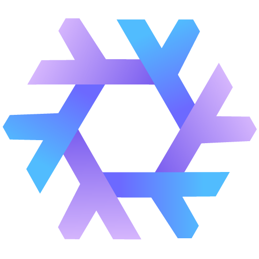
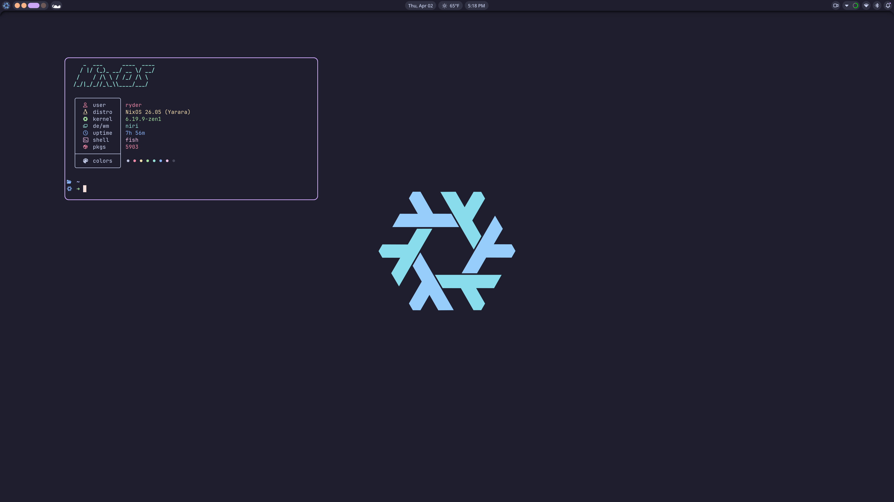

<h1 align="center">
    
   <br>
   AtlasOS
   <br>
   <a href="https://nixos.org">
      
   </a>
   <a href="https://github.com/catppuccin/catppuccin">
      
   </a>
</h1>

<div align="center">
   
   <p><i>Scrolling Wayland workspaces with Niri + Noctalia</i></p>
</div>

---

## 🚀 Overview

This repository contains my personal NixOS configurations, built with modularity and desktop aesthetics in mind. It powers everything from my **M1 MacBook Pro** to my **Desktop PC**.

### Key Highlights

- **Compositor:** [Niri](https://github.com/YaLTeR/niri) -- A scrollable tiling Wayland compositor.
- **Desktop:** [Noctalia](https://github.com/noctalia-dev/noctalia-shell) -- A modern, sleek shell for Niri.
- **Hardware:**
  - **Apple Silicon:** Native Asahi Linux support on M1 (Host: **Sputnik**).
  - **Desktop Power:** Nvidia setup with LLMs and Gaming (Host: **Praxis**).
- **Workflow:**
  - **Editor:** [Nixvim](https://github.com/Ryder-C/nixvim) -- My modular Neovim setup.
  - **Shell:** Fish + Starship
  - **Multiplexer:** Zellij with integrated Yazi file management.
- **Modularity:** Clean separation of "aspects" (gaming, dev, media) that can be plugged into any host.

---

## Architecture

The configuration is organized into a modular tree structure under `modules/`. Everything uses the `ry` namespace.

```text
modules/
├── hosts/        # Machine-specific configurations (Praxis, Sputnik, etc.)
├── aspects/      # Pluggable feature modules (Gaming, Niri, Nixarr)
├── systems.nix   # Logical layers (Base -> Workstation -> Desktop)
└── namespace.nix # Modular integration logic
```

---

## The Fleet

| Host        | Hardware         | Role     | Key Features                                |
| :---------- | :--------------- | :------- | :------------------------------------------ |
| **Praxis**  | Desktop (Nvidia) | Main Rig | Gaming, Nixarr, LLMs (Ollama), Star Citizen |
| **Sputnik** | MacBook Pro (M1) | Portable | Asahi, HiDPI Niri, Battery Optimization     |
| **Fornax**  | Server           | Home Lab | Media, Nixarr, Headless                     |
| **Tabula**  | VM / WSL         | Minimal  | Terminal tools & Dev essentials             |
| **Umbra**   | MacBook Pro (M1) | macOS    | Nix-darwin, Home-manager                    |

---

## Technical Stack

- **OS:** NixOS (Unstable)
- **Theme:** [Catppuccin Mocha](https://github.com/catppuccin/catppuccin) (Mauve accent)
- **Typing:** Colemak-DH (via Niri layout)
- **Management:** `nh` (Nix Helper) for clean system updates.

---

## Credits

Modified and evolved from Frost-Phoenix's original configurations. Built with ❄️ and 🦀.
