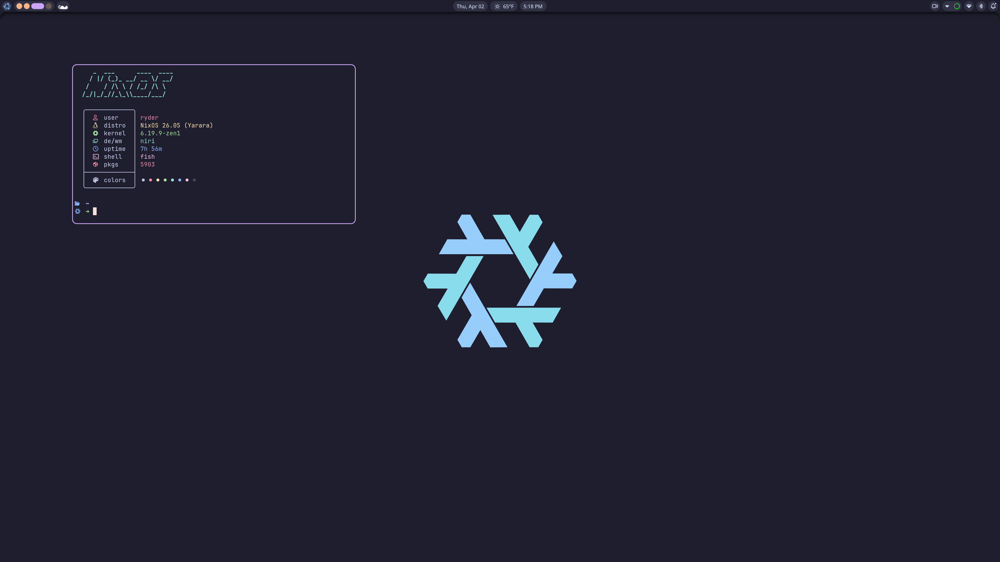

<h1 align="center">
    
    
   AtlasOS
    
   
   
</h1>

   
   
<i>Scrolling Wayland workspaces with Niri + Noctalia</i>

---

## Credits

Modified and evolved from Frost-Phoenix's original configurations. Built with ❄️ and 🦀.
